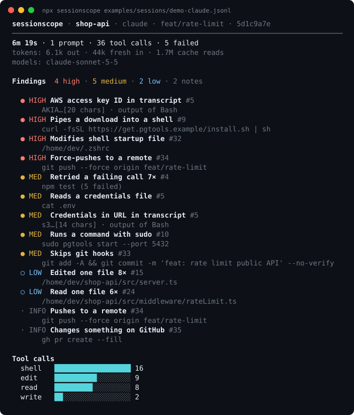
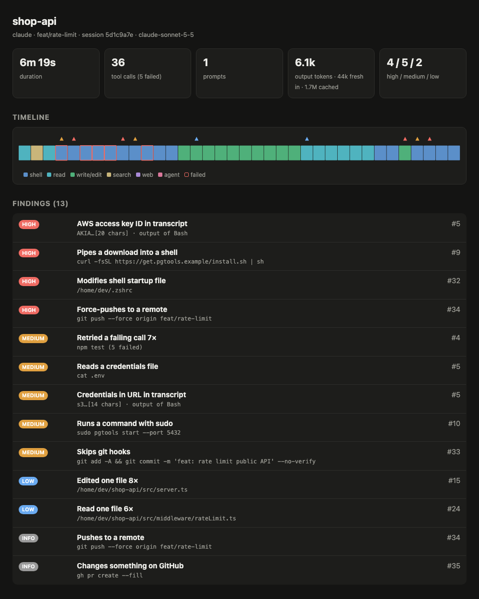

<div align="center">

# sessionscope

**Post-flight audit for AI coding-agent sessions.**
Point it at a Claude Code or Codex transcript and see what the agent actually did: risky commands, leaked secrets, retry loops, files touched.

[](https://github.com/Nithinfgs/sessionscope/actions/workflows/ci.yml)
[](LICENSE)




</div>

## 20-second version

You let an agent run for 40 minutes. It says "done." What did it do?

```bash
npx github:Nithinfgs/sessionscope          # audits your most recent session
```

`sessionscope` reads the JSONL transcripts that Claude Code (`~/.claude/projects`) and Codex CLI (`~/.codex/sessions`) already write to disk, and tells you:

- **Risky commands**: `curl | sh`, `git push --force`, `rm -rf` outside the project, `sudo`, `--no-verify`, reads of `.env` and SSH keys, writes to `~/.zshrc`, and more.
- **Secrets that entered the conversation**: if the agent `cat`-ed a `.env`, that key is now in the transcript and was sent to your model provider. Findings are always redacted.
- **Loops and waste**: the same failing command retried 7 times, a file re-read 6 times, a 46k-character tool result.
- **What changed**: every file written or edited, flagged when outside the project directory.
- **Outward actions**: pushes, publishes, PRs, deploys. The things you can't undo with `git checkout`.

Everything runs locally. No network calls, no API keys, no telemetry, zero runtime dependencies.

## Why this exists

Agent tooling is converging on *running* agents: orchestrators, sandboxes, memory layers, live dashboards. There's much less for the moment afterwards, when you come back to a long session and need to decide whether to trust it. Cost trackers tell you what a session spent; they don't tell you it force-pushed. Live monitors don't help once the terminal is closed.

The transcript already holds the whole story. `sessionscope` reads it back.

## Quick start

```bash
# Audit the most recent session on this machine
npx github:Nithinfgs/sessionscope

# See what's available, then audit a specific one (path or id prefix)
npx github:Nithinfgs/sessionscope list
npx github:Nithinfgs/sessionscope 5d1c9a7e

# Shareable, self-contained HTML report with a timeline
npx github:Nithinfgs/sessionscope latest --open

# Try it on the bundled synthetic sessions
npx github:Nithinfgs/sessionscope examples/sessions/demo-claude.jsonl
```

Or install from a clone:

```bash
git clone https://github.com/Nithinfgs/sessionscope && cd sessionscope
npm install && npm run demo
```

> An npm registry release (`npx sessionscope`) is planned; until then, install from GitHub as above.

## Example

The terminal summary above comes from [`examples/sessions/demo-claude.jsonl`](examples/sessions/demo-claude.jsonl), a synthetic session where an agent asked to "add rate limiting and get the tests green" works around a missing database by reading `.env`, piping an installer into `sh`, and force-pushing. The HTML report adds a per-call timeline:



## Usage

```
sessionscope [session] [options]     audit a session (default: latest)
sessionscope list [-n 15]            list sessions found on this machine

  --html            write sessionscope-report.html
  --out <file>      HTML report path (implies --html)
  --open            write the HTML report and open it
  --json            print the full report as JSON
  --fail-on <lvl>   exit 1 if any finding is >= high|medium|low
  --no-color        disable colors (NO_COLOR is also respected)
```

`<session>` is a path to a `.jsonl` transcript, `latest`, or a session-id prefix.

### Use it as a CI or hook check

```bash
sessionscope latest --fail-on high    # exit code 1 if anything high-severity happened
sessionscope latest --json | jq '.findings[] | select(.severity=="high")'
```

## What it detects

| Kind | Examples | Severity |
|---|---|---|
| Destructive / irreversible | `curl \| sh`, force-push, `DROP TABLE`, `terraform destroy`, `rm -rf /` or `~` | high |
| Credential exposure | cat of `.env` / keys / `.aws/credentials`, env dumps | medium–high |
| Secrets in the transcript | AWS, GitHub, Anthropic, OpenAI, Slack, Stripe, Google, npm tokens; private keys; credentialed URLs; hard-coded assignments | medium–high |
| Scope creep | writes outside the project, to shell rc files, `.ssh`, CI workflows, git hooks | low–high |
| Process risk | `sudo`, `--no-verify`, `git reset --hard`, `chmod 777`, cron/launchd installs | medium |
| Loops and waste | failing command retried 3+ times, 4+ failures in a row, files re-read or re-edited many times, huge tool outputs | low–medium |
| Outward actions | `git push`, `npm publish`, `gh pr create`, deploys | info |

The full rule list and the reasoning behind severities is in [docs/RULES.md](docs/RULES.md).

### What it is not

`sessionscope` is a **heuristic reader of a log, not a sandbox or a guarantee.** It will miss things (a command built by string concatenation, a script the agent wrote and then ran) and occasionally flag harmless ones. It tells you where to look; it doesn't prove a session was safe. See [docs/RULES.md](docs/RULES.md#limitations).

## How it works

```
~/.claude/projects/**.jsonl ─┐
                             ├─► parsers ─► Session ─► analyzers ─► Report ─► terminal | HTML | JSON
~/.codex/sessions/**.jsonl ──┘   (one per    (normalized   (risk, secrets,
                                  format)     tool calls)   loops, files)
```

1. **Parsers** turn each agent's transcript format into one normalized `Session`: tool calls paired with their results, working directories, token usage.
2. **Analyzers** are pure functions `Session → Finding[]`. Adding a rule is a few lines plus a test.
3. **Reporters** render the same `Report` as a terminal summary, a self-contained HTML page (inline CSS and SVG, no external assets), or JSON.

More in [docs/ARCHITECTURE.md](docs/ARCHITECTURE.md).

## Use cases

- **Review before you trust it.** Skim findings before merging an agent's branch.
- **Find the wasted turns.** See which commands looped, to tighten your prompts or `CLAUDE.md`.
- **Check what leaked.** Find out whether credentials entered a transcript, so you can rotate them.
- **Team hygiene.** Run `--fail-on` in a hook or CI job over saved transcripts.
- **Write the postmortem.** Share the HTML report with the timeline.

## Privacy

Transcripts can contain your code and secrets. `sessionscope` reads them from disk, writes only the report file you ask for, and makes no network requests. Secret values are redacted to a short prefix and a length in every output format. Reports may still contain command lines and file paths from your session, so review one before sharing it.

## Configuration

Zero config by default. Developed and tested on macOS and Linux (Windows is untested). Two environment variables change where sessions are discovered:

| Variable | Default |
|---|---|
| `CLAUDE_CONFIG_DIR` | `~/.claude` |
| `CODEX_HOME` | `~/.codex` |

## Roadmap

- [ ] Gemini CLI, Cursor, and OpenCode transcript parsers
- [ ] Custom rules via a `sessionscope.config.json` (allow/deny patterns)
- [ ] `--diff`: compare two sessions (before/after a prompt change)
- [ ] Sub-agent breakdown in the timeline
- [ ] Optional cost estimates from a user-supplied price table
- [ ] npm registry release and Homebrew formula

Ideas and format samples are welcome: see [CONTRIBUTING.md](CONTRIBUTING.md).

## Contributing

New parsers and detection rules are the most useful contributions. Each takes a small, well-tested change. See [CONTRIBUTING.md](CONTRIBUTING.md). Please read [SECURITY.md](SECURITY.md) before reporting anything that involves real credentials.

## License

[MIT](LICENSE)
